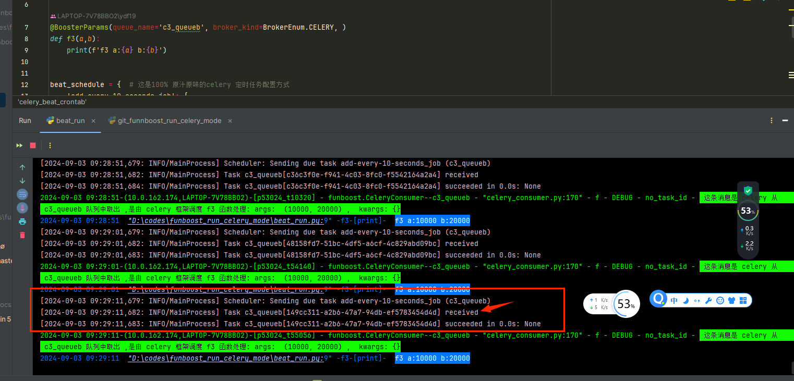

# 0 funboost_run_celery_mode
funboost_run_celery_mode，  funboost的celery运行模式。

## 0.1 funboost运行celery中间件模式比手动操作celery框架的好处

完全无需文件夹目录结构

完全无需配置imports includes

完全无需配置task_routes

完全无需敲击celery worker 难记的命令行。


## 0.2 需要做的：

在 funboost_config.py 中设置 ：
```
CELERY_BROKER_URL (必须)
CELERY_RESULT_BACKEND (非必须)
```

设置 broker_kind 为Celery：

@BoosterParams(broker_kind=BrokerEnum.CELERY)

# 1  run.py 演示worker消费

CeleryHelper.realy_start_celery_worker(worker_concurrency=300, is_start_consume_all_queues=True)

# 2 beat_run.py 演示定时任务触发发布。

CeleryHelper.celery_start_beat(beat_schedule) # 启动定时发布任务

# 3 运行截图，证明100%是celery框架核心来调度函数，而不是funboost的核心来调度运行函数

